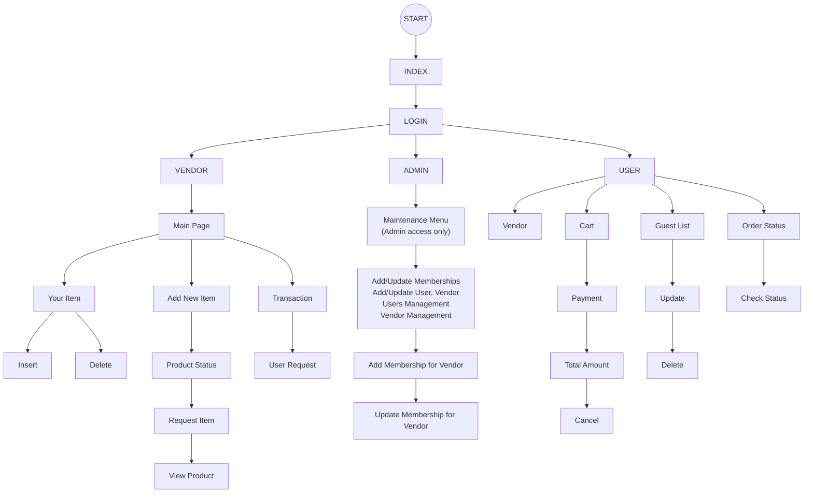

# Event Management System

Next.js + TypeScript Event Management System with role-based access for Admin, User, and Vendor, Prisma persistence, and NextAuth credentials login.

## Flowchart



Chart is also rendered at `/chart` and linked in the header on all pages.

## Screenshot


## Tech Stack

- Next.js Pages Router
- TypeScript
- Tailwind CSS
- Prisma + SQLite
- NextAuth (Credentials)
- react-hook-form + zod
- react-toastify
- bcrypt
- Vitest + Cypress skeleton

## Setup

1. Install dependencies:

```bash
npm install
```

2. Create `.env` from `.env.example`:

```env
DATABASE_URL="file:./dev.db"
NEXTAUTH_SECRET="replace_with_a_long_random_secret"
```

3. Run migration:

```bash
npm run prisma:migrate
```

4. Seed data:

```bash
npm run prisma:seed
```

5. Start app:

```bash
npm run dev
```

Open `http://localhost:3000`.

## Scripts

- `npm run dev`
- `npm run build`
- `npm run start`
- `npm run prisma:migrate`
- `npm run prisma:seed`
- `npm run test`
- `npm run cypress:open`

## Seed Credentials

- Admin: `admin@example.com` / `AdminPass1!`
- User: `user@example.com` / `UserPass1!`
- Vendor: `vendor@example.com` / `VendorPass1!`

Seeded membership:

- `MEM-0001` mapped to `vendor@example.com`, 6 months, ACTIVE.

## Tests

- Unit test:

```bash
npm run test
```

- Cypress skeleton:

```bash
npm run cypress:open
```

## Notes

- Passwords are hashed with bcrypt and never returned from API.
- Role checks exist in middleware, API guards, and page-level SSR guards.
- Add Membership enforces required fields and default 6-month radio selection.
- Update Membership loads by membership number and supports extend (default 6 months) or cancel.
